# BrandLens — App Flow

Complete user flow diagrams and step-by-step flows for every major journey in BrandLens.

---

## 1. Agency Onboarding Flow

### Diagram

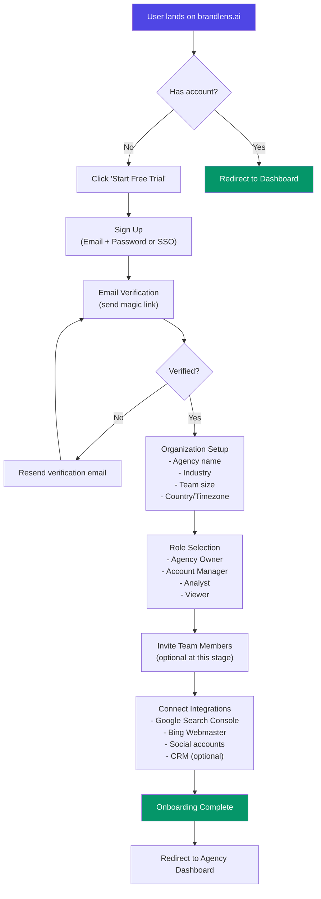

### Step-by-Step

| Step | Screen | Key Actions | Validation |
|------|--------|-------------|------------|
| 1 | Landing → Sign Up | Email, password, agree to TOS | Email format, password strength (min 8 chars) |
| 2 | Email Verification | Click magic link in inbox | Token expiry 24h |
| 3 | Organization Setup | Agency name, industry, size, timezone | Required fields, unique org name |
| 4 | Role Selection | Choose role from dropdown | None |
| 5 | Team Invites | Enter emails, assign roles | Valid email format, max 10 per batch |
| 6 | Integrations | OAuth connect to GSC, Bing, social | OAuth callback, token storage |
| 7 | Dashboard Redirect | Auto-redirect after 2s delay | None |

---

## 2. Brand Setup Flow

### Diagram

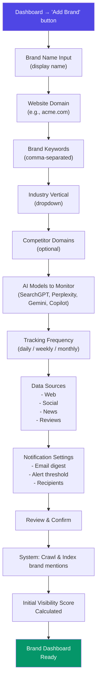

### Step-by-Step

| Step | Screen | Key Actions | Validation |
|------|--------|-------------|------------|
| 1 | Add Brand Modal | Brand name (required) | Min 2 chars |
| 2 | Domain | Website URL | Valid URL format |
| 3 | Keywords | Comma-separated keywords | Min 3 keywords, max 50 |
| 4 | Industry | Select from predefined list | Required |
| 5 | Competitors | Optional competitor URLs | Valid URL format if entered |
| 6 | AI Models | Toggle models on/off | At least 1 required |
| 7 | Frequency | Daily / Weekly / Monthly | Required |
| 8 | Data Sources | Checkboxes for source types | At least 1 required |
| 9 | Notifications | Configure alerts | Optional |
| 10 | Review | Summary of all inputs | Edit any section |
| 11 | Processing | Loading spinner, progress bar | None (system processing) |
| 12 | Brand Dashboard | Navigate to brand detail | None |

---

## 3. Dashboard Navigation Flow

### Diagram

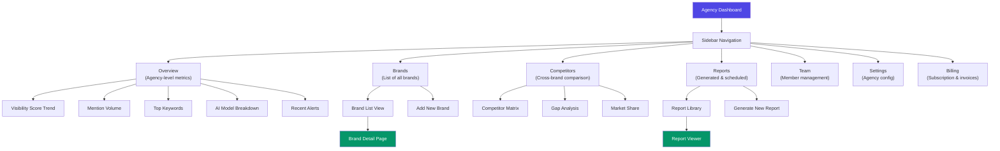

### Navigation Structure

```
┌─────────────────────────────────────────────────────────┐
│ [Logo] BrandLens [Search] [Notifications] [👤] │
├──────────┬──────────────────────────────────────────────┤
│ │ MAIN CONTENT AREA │
│ SIDEBAR │ │
│ │ │
│ Overview│ │
│ Brands │ │
│Competitors│ │
│ Reports │ │
│ Team │ │
│ Settings │ │
│ Billing │ │
│ │ │
│ Help │ │
│ │ │
├──────────┴──────────────────────────────────────────────┤
│ [Status bar: last updated | data sources | next crawl] │
└─────────────────────────────────────────────────────────┘
```

### Responsive Behavior

| Breakpoint | Sidebar | Content | Actions |
|-----------|---------|---------|---------|
| Desktop (>= 1024px) | Fixed left, 260px | Full width remaining | Full navigation visible |
| Tablet (768px – 1023px) | Collapsible overlay | Full width | Hamburger toggle |
| Mobile (< 768px) | Bottom tab bar | Full width | Bottom nav, simplified cards |

---

## 4. Report Generation Flow

### Diagram

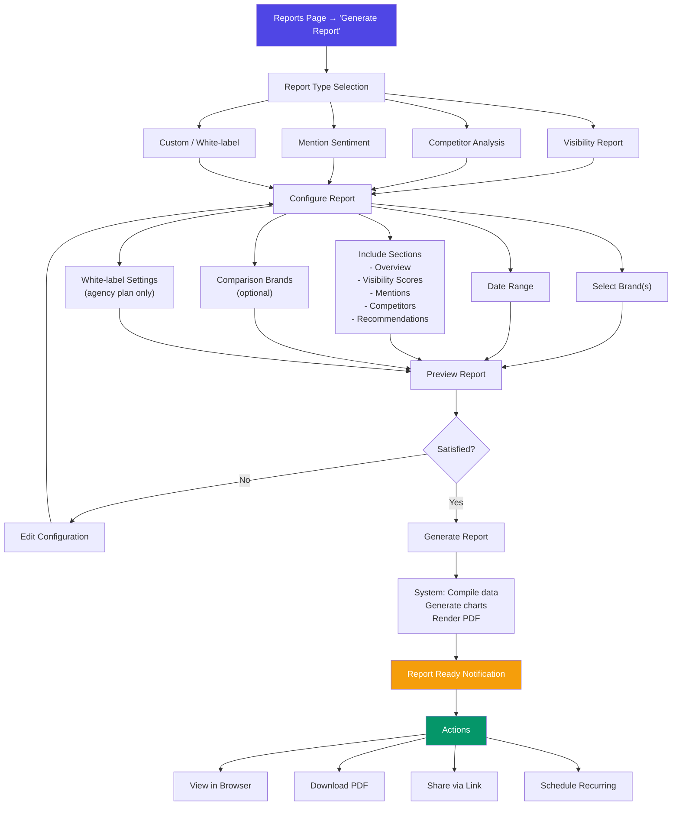

### Report Configuration Options

| Option | Values | Default | Notes |
|--------|--------|---------|-------|
| Date Range | 7d, 30d, 90d, 1y, Custom | 30d | Custom via date picker |
| Brand Selection | Single / Multiple / All | All active | Multi-select dropdown |
| Comparison Brands | None / Selected | None | Adds competitor section |
| Sections | Toggle each section | All on | Can reorder via drag |
| Format | PDF / HTML / CSV data | PDF | PDF for sharing, HTML for embed |
| White-label | On / Off | Off | Agency/Enterprise only |
| Recurrence | None / Weekly / Monthly | None | Sends to configured recipients |

---

## 5. White-Label Configuration Flow

### Diagram

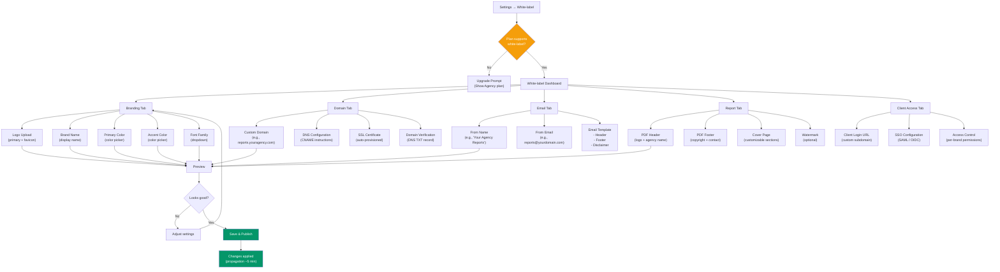

### White-label Feature Matrix

| Feature | Starter | Pro | Agency | Enterprise |
|---------|---------|-----|--------|------------|
| Custom Logo | — | — | ✓ | ✓ |
| Custom Colors | — | — | ✓ | ✓ |
| Custom Domain | — | — | ✓ | ✓ |
| Custom Email From | — | — | ✓ | ✓ |
| PDF White-labeling | — | — | ✓ | ✓ |
| Client SSO | — | — | — | ✓ |
| Remove BrandLens branding | — | — | — | ✓ |
| Dedicated Infrastructure | — | — | — | ✓ |

---

## 6. Billing / Subscription Flow

### Diagram

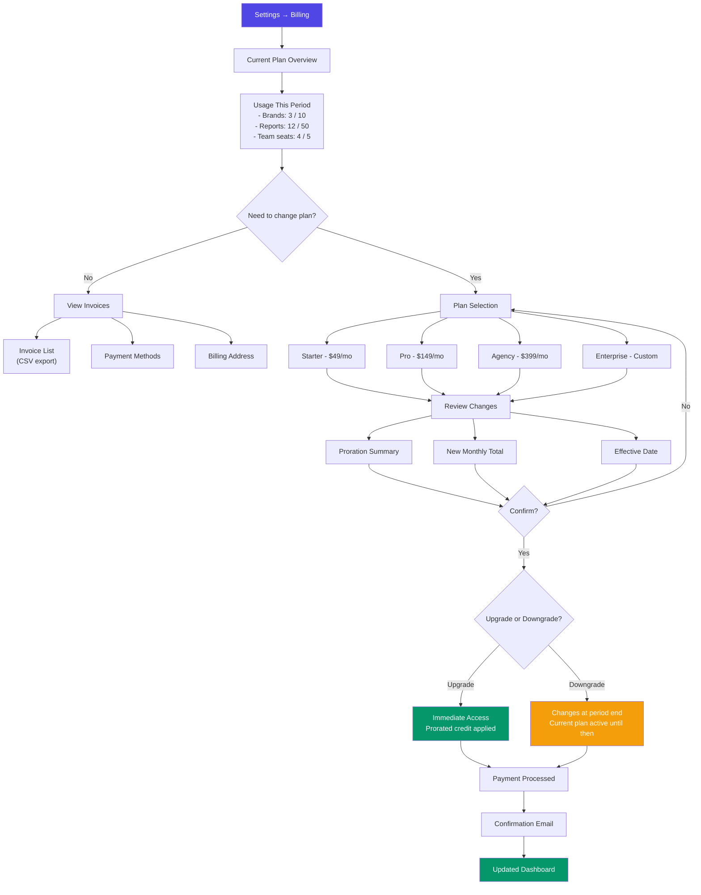

### Subscription States

| State | Description | User Can |
|-------|-------------|----------|
| **Active** | Plan is current, payment succeeded | Full access |
| **Past Due** | Payment failed, grace period (3 days) | Full access, retry prompt |
| **Canceled** | Scheduled for end of period | Read-only access to data |
| **Expired** | Period ended, no renewal | View-only, cannot generate reports |
| **Trialing** | Free trial in progress | Full access, upgrade prompts |

### Billing Page Layout

```
┌─────────────────────────────────────────────────────────┐
│ Billing & Subscription │
├─────────────────────────────────────────────────────────┤
│ │
│ Current Plan: Pro [$149/mo] [Change Plan] │
│ Status: Active | Renews: Oct 6, 2026 │
│ │
│ Usage This Period │
│ ┌──────────┬──────────┬──────────┬──────────┐ │
│ │ Brands │ Reports │ Team │ API Calls│ │
│ │ 6 / 25 │ 18 / 100 │ 3 / 10 │ 4.2K/10K │ │
│ │ [====---]│ [===-----]│ [==------]│ [==-----]│ │
│ └──────────┴──────────┴──────────┴──────────┘ │
│ │
│ Payment Method │
│ Visa ending in 4242 [Update] │
│ Billing: Acme Corp, 123 Main St, SF, CA │
│ │
│ Invoices │
│ ┌────┬──────────┬────────┬────────┐ │
│ │ # │ Date │ Amount │ Status │ │
│ ├────┼──────────┼────────┼────────┤ │
│ │1234│ Sep 6 │ $149 │ Paid │ │
│ │1233│ Aug 6 │ $149 │ Paid │ │
│ │1232│ Jul 6 │ $149 │ Paid │ │
│ └────┴──────────┴────────┴────────┘ │
│ │
└─────────────────────────────────────────────────────────┘
```

---

## 7. Authentication & Authorization Flow

### Diagram

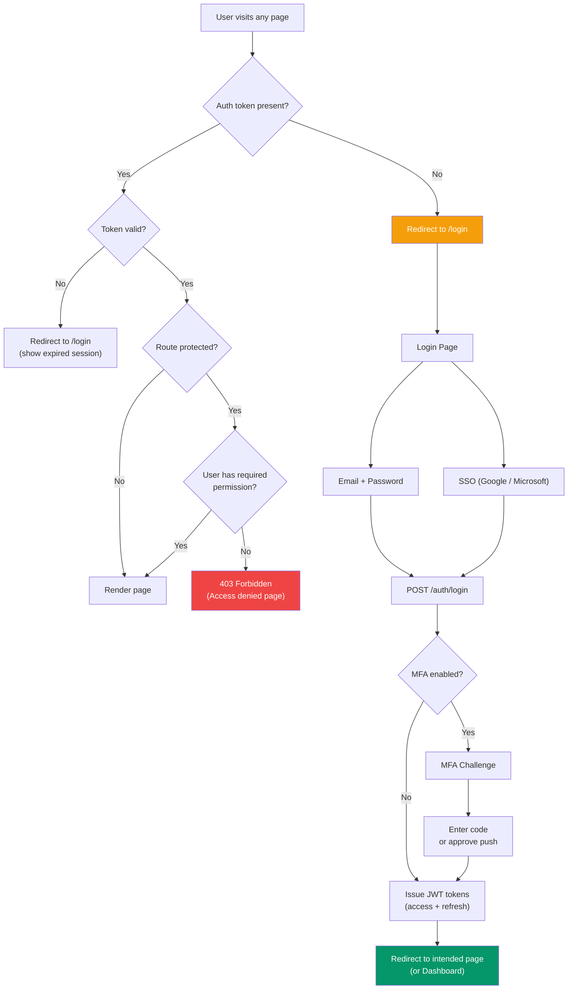

### Permission Matrix

| Role | Brands (CRUD) | Reports (CRUD) | Team (Manage) | Billing | White-label | Settings |
|------|:---:|:---:|:---:|:---:|:---:|:---:|
| Owner | ✓ | ✓ | ✓ | ✓ | ✓ | ✓ |
| Account Manager | ✓ | ✓ | ✓ | — | ✓ | ✓ |
| Analyst | ✓ (read) | ✓ | — | — | — | — |
| Viewer | Read only | Read only | — | — | — | — |

---

## 8. Real-Time Data Flow

### Diagram

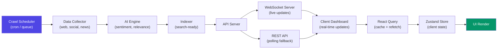

### Update Triggers

| Trigger | Action | UI Response |
|---------|--------|-------------|
| New mention crawled | Push via WebSocket | Toast notification + badge update |
| Visibility score change | Push via WebSocket | Score animation + trend arrow |
| Scheduled report ready | Email + in-app notification | Bell icon badge + modal |
| Team member action | Polling (30s) | Presence indicator |
| Billing event | Email + in-app | Banner notification |

---

## 9. Error & Edge-Case Flows

### Payment Failure

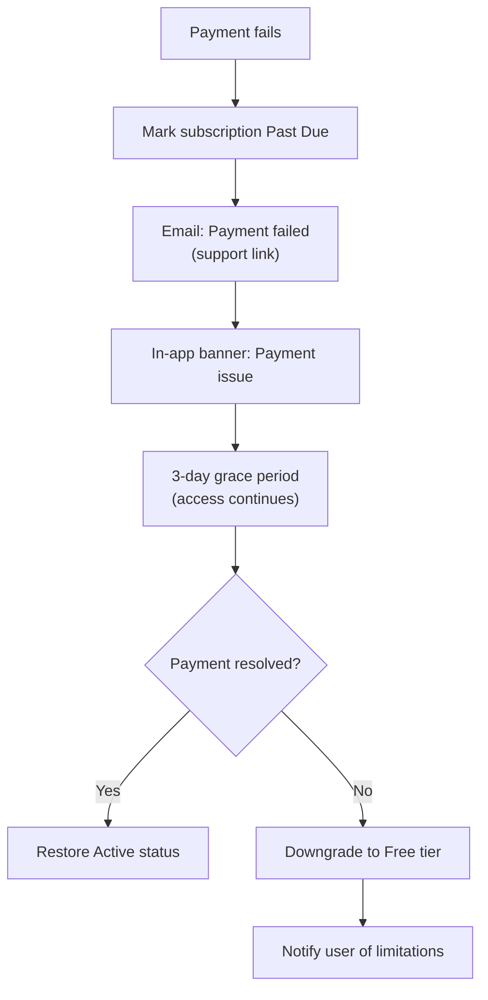

### Report Generation Failure

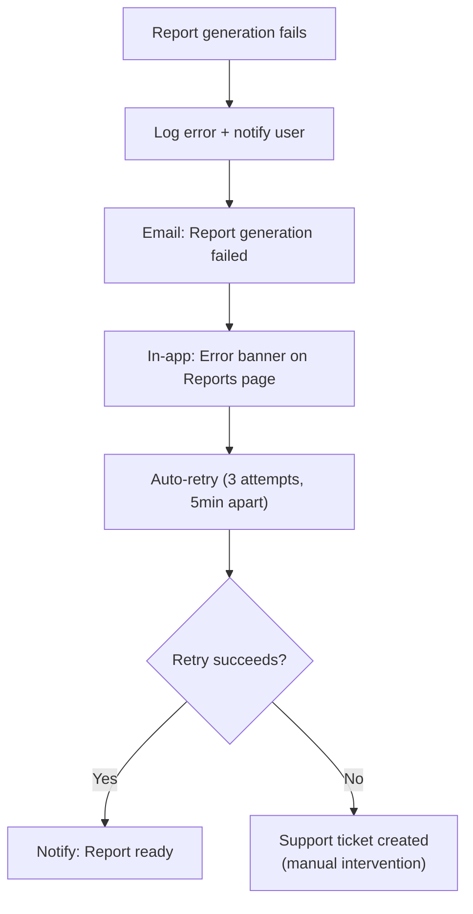

---

## 10. Mobile App Flow (Future)

### Diagram

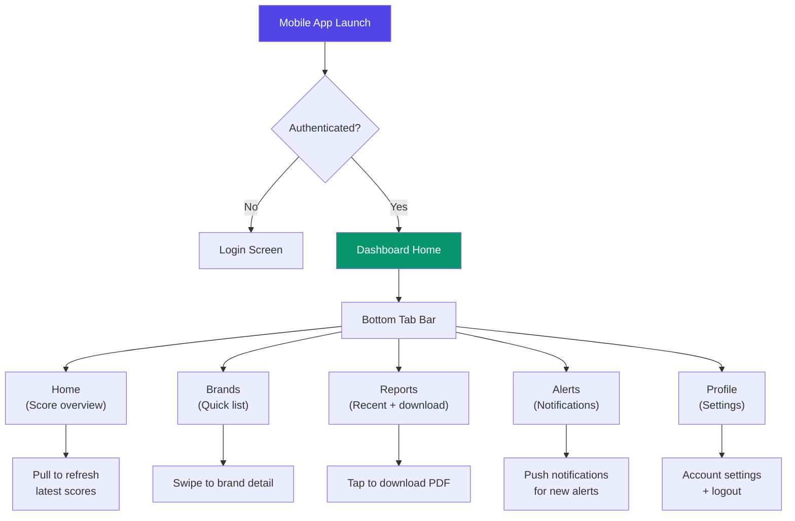

---

*Last updated: 2026-09-06*
